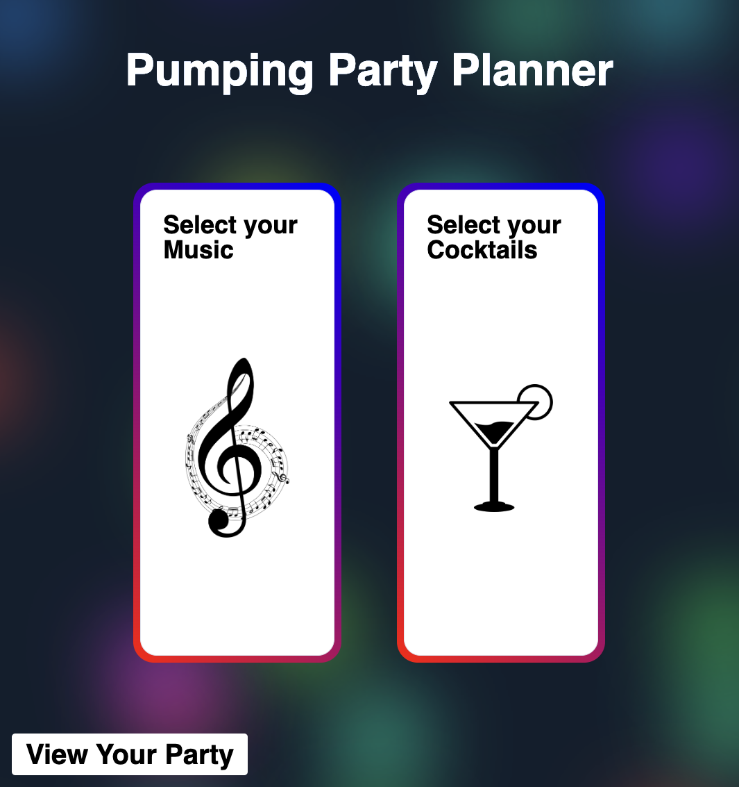
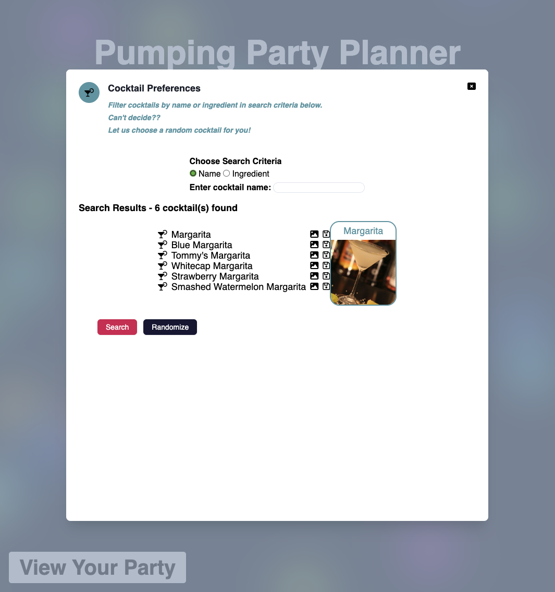
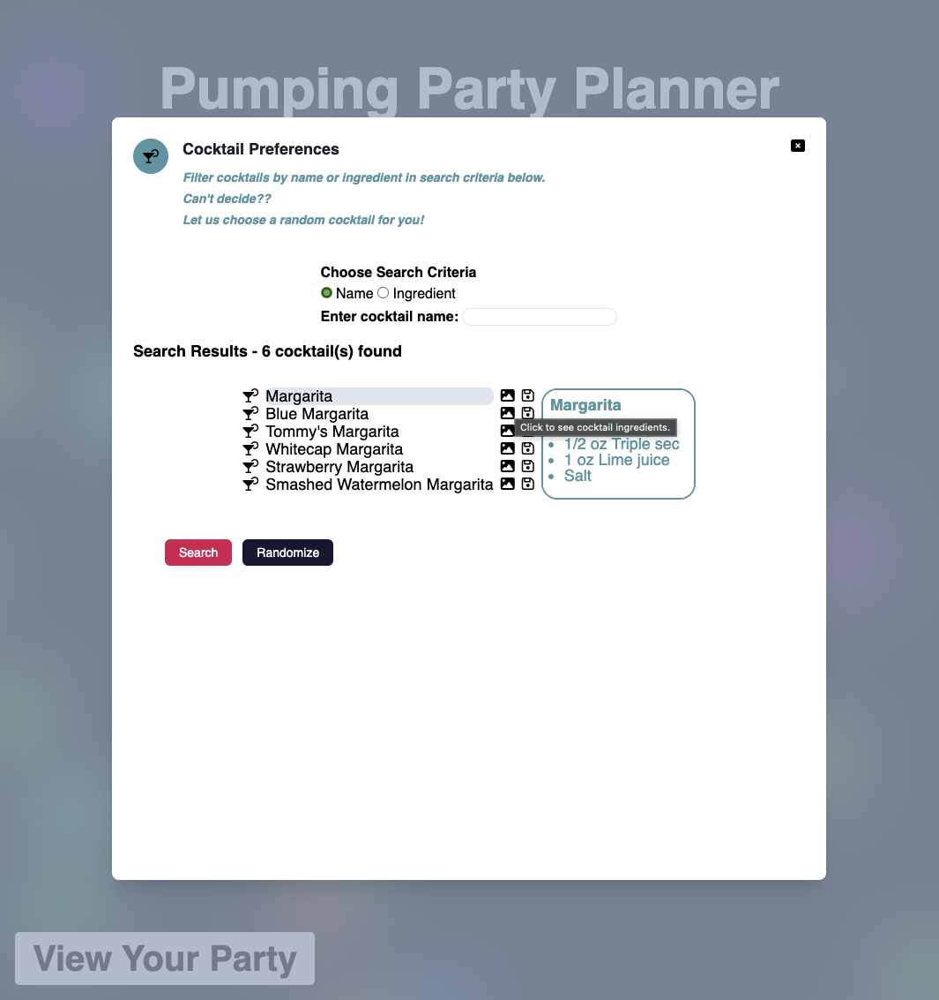
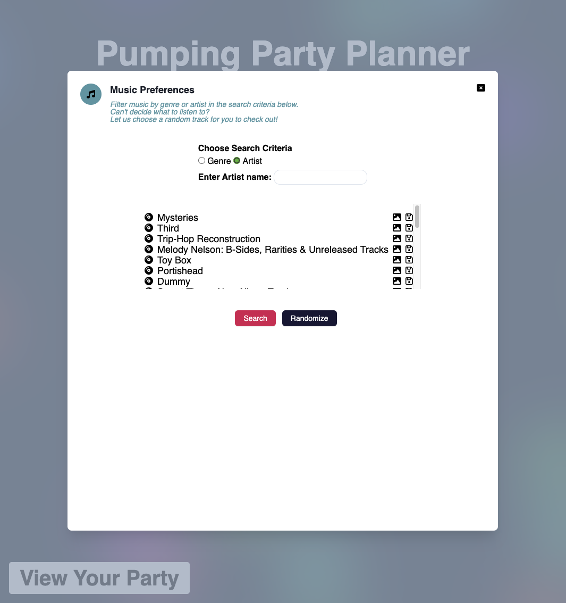
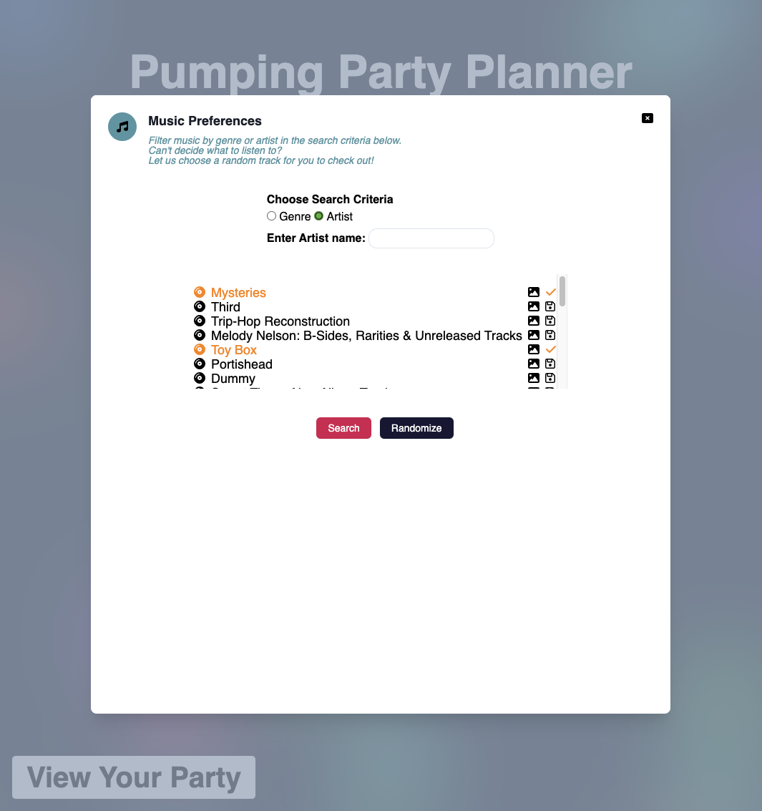
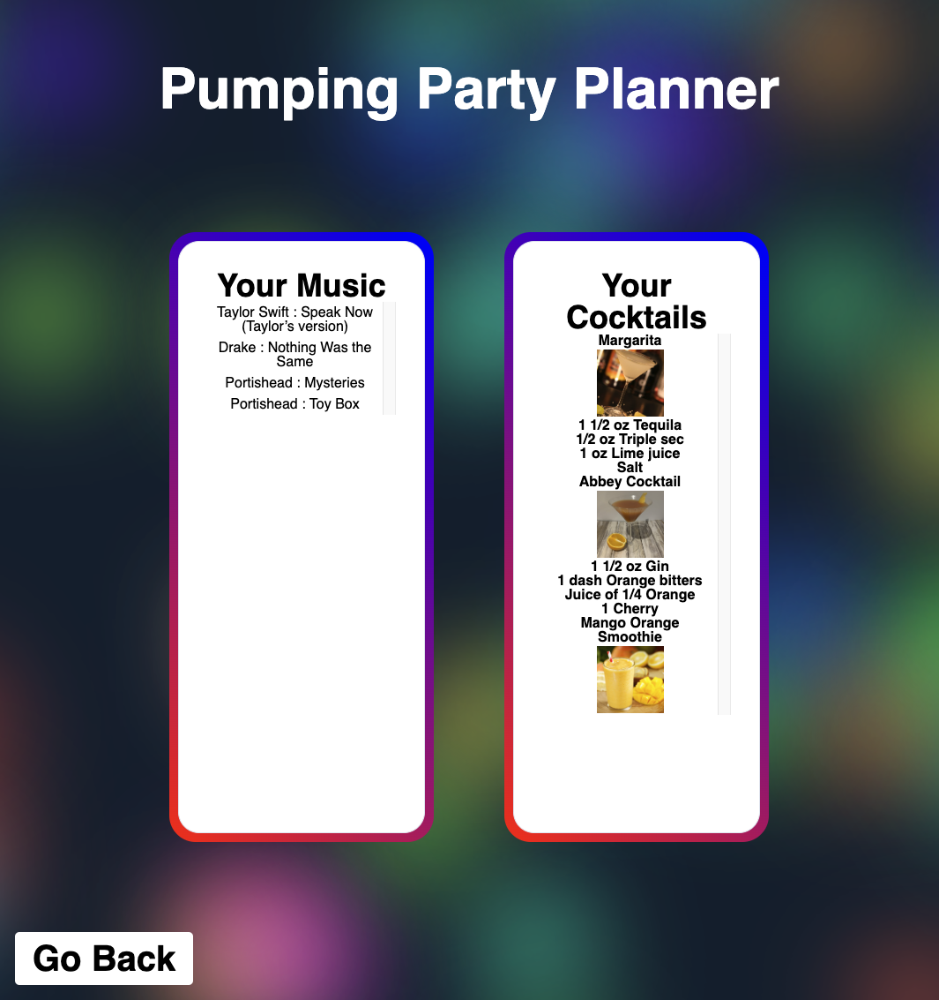
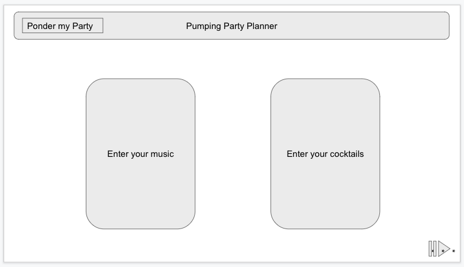
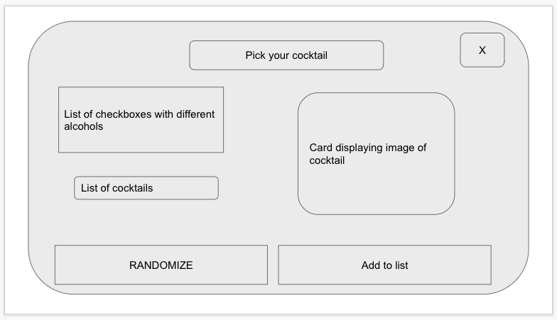
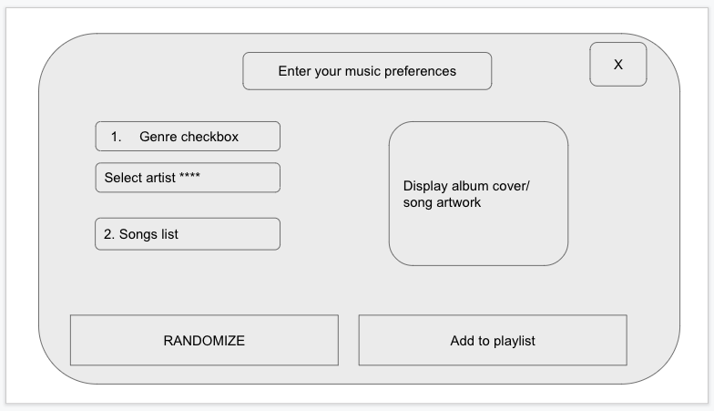
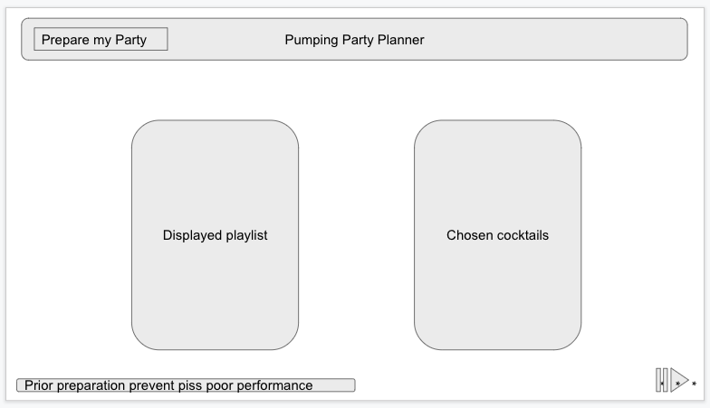

# Pumping Party Planner

## Description

Pumping Party Planner is a web application which allows users to search for music or cocktail to save for their party plans.
Users are able to search for cocktails by either cocktail name, or ingredients. 
When searching for music, users are able to filter results by either genre or artists name.
Once a user has selected their search criteria, they will be presented with the relevant results.
Each cocktail result includes the cocktail name, ingredients and an image of the cocktail.
If the user searches for Music, they will be provided with a list of albums.  
Users can select their preferred music and cocktails choices to save for their personal party plan. 
Pumping Party Planner is a fantastic tool for planning any memorable party.

### What was your motivation?
We wanted to develop a web application that would provide real value to users and fun to develop.
As a team we wanted to create an application that would challenge us but create something that we could relate to and see ourselves using in our own lives. 

### User Story
```
As a person wanting to plan a party
I want to be able to select either my music or cocktail preferences
So that I have have a list of cocktail ingredients and music which works with it
```

### Acceptance Criteria
```
Given I want to have a party with music and cocktails
When I enter my music/cocktail preferences
Then I recieve a list of the appropirate cocktail/music to mach my original preferences. 
```
## Installation
https://caoimhejyoti.github.io/pumping-party-planner/
## Usage
Pumping Party Planner - Landing Page


Pumping Party Planner - Cocktail Modal
List of Search results for Cocktail Modal, with image.


List of Search results for Cocktail Modal, with ingredients.


*Pumping Party Planner - Music Modal*
List of Search results for Music Modal


Users can see when they have saved their choices by the colour of their choice changing to orange.


*Pumping Party Planner - Planned Party Page*
Users are able to see the party that they have planned

## Wire Frame




## Future Development
1. We would like to develop this into a server side web app. By doing this, we will open the doors to multiple different developments. 
    a. Using a server allows us to work with a more advanced music API. This will allow us get a greater range of resources for our users to make their choices from.
    b. Having a server allows us to create the ability for users to create a user so that they can save parties for the future. It also allows us to look at the possibility of users sharing parties. This would mean multiple users could contribute to one party, making it easier for our users to plan their Pumping Party!

2. We would love to add the ability for users to be able to play their personally curated party playlists directly from our web app. 

3. The cocktail API offers a paid endpoint where you can search for cocktails with multiple ingredients. We would like to develop our own version of this using the single ingredient API and javascript.
The free API also offers other endpoints we would like to incorporate into the web site such as search for non alcoholic cocktails, search by glass type (champagne flute, cocktail glass etc)

4. Minor style/layout improvements to the listing of data, specially where images/ingredients are displayed.

## Credits
### APIs:
Cocktails: https://www.thecocktaildb.com/api.php
Music: https://musicbrainz.org/doc/MusicBrainz_API

## Resources:
### Group Presentation:
[Pumping Party Planner Presentation - SLIDES WITH NOTES](assets/pdf/Pumping%20Party%20Planner.pdf)
[Pumping Party Planner Presentation - SLIDE VIDEO](assets/pdf/Pumping%20Party%20Planner-presentationslides.mp4)
### Tailwind resources
https://tailwindui.com/components/application-ui/overlays/modals
https://tailwindui.com/components/application-ui/forms/select-menus
https://nerdcave.com/tailwind-cheat-sheet
### API bugs
https://developer.mozilla.org/en-US/docs/Web/HTTP/CORS/Errors/CORSMissingAllowOrigin 
https://developer.mozilla.org/en-US/docs/Web/HTTP/CORS
https://developer.mozilla.org/en-US/docs/Web/API/Fetch_API/Using_Fetch
## Font resources
https://fontawesome.com/icons/compact-disc?s=solid&f=classic

## License
MIT License